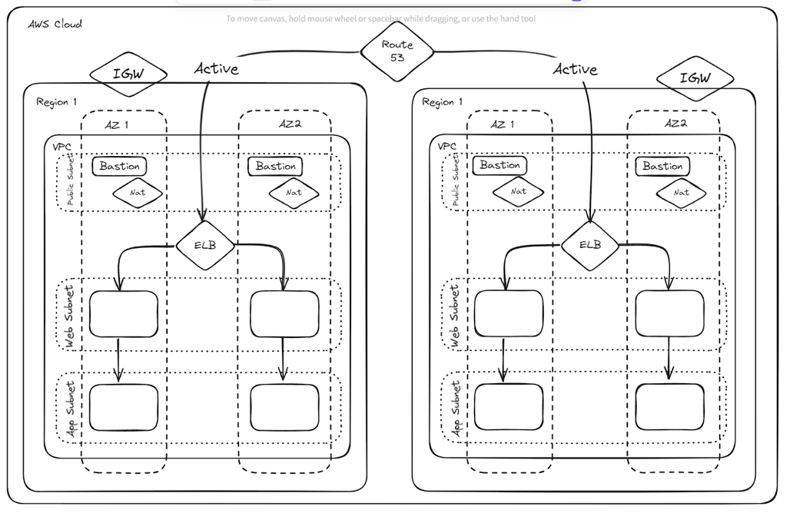

# Terraform AWS Infrastructure with Jenkins CI/CD Pipeline

## Project Overview

This project automates the deployment and management of AWS infrastructure using Terraform and Jenkins. It creates various AWS resources including a Virtual Private Cloud (VPC), public and private subnets, NAT gateways, load balancers, and Route 53 DNS records. The Jenkins pipeline automates the process of deploying the infrastructure to different environments (dev, staging, and prod).



## Prerequisites

Before you begin, ensure you have the following software installed:

- **Terraform**: [Installation Guide](https://learn.hashicorp.com/tutorials/terraform/install-cli)
- **Jenkins**: [Installation Guide](https://www.jenkins.io/doc/book/installing/)
- **AWS CLI**: [Installation Guide](https://docs.aws.amazon.com/cli/latest/userguide/install-cliv2.html)
- **Git**: [Installation Guide](https://git-scm.com/book/en/v2/Getting-Started-Installing-Git)

### Additional Requirements:

- **AWS Account**: Make sure you have an AWS account and access credentials.
- **Jenkins Setup**: Jenkins must be set up and running with the required plugins for Terraform (e.g., Terraform Plugin for Jenkins).

## Project Structure

```text
.
├── backend.tf
├── environments
│   ├── dev
│   │   ├── backend.tfvars
│   │   └── terraform.tfvars
│   ├── prod
│   │   ├── backend.tfvars
│   │   └── terraform.tfvars
│   └── staging
│       ├── backend.tfvars
│       └── terraform.tfvars
├── jenkins
├── jenkinsfile
├── main.tf
├── modules
│   ├── bastion
│   ├── load_balancer
│   ├── nat
│   ├── route53
│   ├── subnets
│   └── vpc
├── outputs.tf
├── scripts
│   ├── apply.sh
│   ├── destroy.sh
│   ├── init.sh
│   ├── jenkins.sh
│   ├── jenkins_installation.sh
│   └── plan.sh
├── variables.tf
└── versions.tf
```

- **`backend.tf`**: Configuration for the remote backend to store Terraform state.
- **`environments/`**: Contains environment-specific variables for dev, staging, and prod.
- **`modules/`**: Contains reusable Terraform modules for different infrastructure components:
  - `bastion`: Creates a bastion host.
  - `load_balancer`: Configures the load balancer.
  - `nat`: Configures NAT gateway.
  - `route53`: Sets up Route 53 DNS.
  - `subnets`: Configures subnets and routing.
  - `vpc`: Creates the VPC.
- **`jenkins/`**: Directory to store Jenkins-specific configurations and files.
- **`scripts/`**: Contains shell scripts for automating Terraform commands (init, apply, destroy, etc.).
- **`variables.tf`**: Contains variable definitions for Terraform.
- **`versions.tf`**: Specifies Terraform provider versions.

## Setup and Installation

### Step 1: Clone the Repository

Clone the repository to your local machine.

```bash
git clone https://github.com/your-username/terraform-jenkins-aws.git
cd terraform-jenkins-aws
```

### Step 2: Set up AWS Credentials

Make sure your AWS credentials are set up correctly. You can configure AWS CLI with the following command:

```bash
aws configure
```

Alternatively, you can export your credentials as environment variables:

```bash
export AWS_ACCESS_KEY_ID="your-access-key"
export AWS_SECRET_ACCESS_KEY="your-secret-key"
export AWS_DEFAULT_REGION="your-region"
```

### Step 3: Configure Environment Variables

Navigate to the `environments` folder and update the `terraform.tfvars` files for the respective environment (`dev`, `staging`, or `prod`). Define the appropriate CIDR blocks, region, and other environment-specific variables.

### Step 4: Install Jenkins (Optional)

If Jenkins is not installed, you can use the provided script `scripts/jenkins_installation.sh` to install Jenkins.

```bash
bash scripts/jenkins_installation.sh
```

### Step 5: Set up Jenkins Pipeline

The `Jenkinsfile` located in the root directory defines the stages of the CI/CD pipeline. The pipeline will automatically run the following Terraform commands:

- **`terraform init`**: Initializes the Terraform configuration.
- **`terraform plan`**: Previews changes that will be made to the infrastructure.
- **`terraform apply`**: Applies the changes to create or update the infrastructure.
- **`terraform destroy`**: Destroys the infrastructure.

## Terraform Commands

### Initialize Terraform

To initialize Terraform in a specific environment (e.g., `dev`):

```bash
cd environments/dev
bash ../../scripts/init.sh
```

### Plan Terraform Changes

To see what changes Terraform will make to the infrastructure:

```bash
cd environments/dev
bash ../../scripts/plan.sh
```

### Apply Terraform Changes

To apply the Terraform plan:

```bash
cd environments/dev
bash ../../scripts/apply.sh
```

### Destroy Terraform Infrastructure

To destroy the created infrastructure:

```bash
cd environments/dev
bash ../../scripts/destroy.sh
```

## Jenkins Pipeline

The Jenkins pipeline defined in `Jenkinsfile` automates the Terraform deployment process. It consists of the following stages:

1. **Checkout**: Retrieves the latest code from the Git repository.
2. **Terraform Init**: Initializes Terraform in the respective environment.
3. **Terraform Plan**: Generates and shows the execution plan.
4. **Terraform Apply**: Applies the infrastructure changes to AWS.
5. **Terraform Destroy** (optional): Cleans up the infrastructure.


## Jenkins Installation

### Using `jenkins_installation.sh` Script
1. Navigate to the script folder
   ```bash
   cd script
   ```

2. Make the script executable
   ```bash
   chmod +x jenkins_installation.sh
   ```

3. Run the installation script
   ```bash
   ./jenkins_installation.sh
   ```

## Jenkins Pipeline Configuration

### Step 1: Plugin Installation
Install the following Jenkins plugins:
- Pipeline
- Git
- Credentials Binding
- AWS Credentials Plugin

#### Installation Process
1. Go to **Manage Jenkins > Manage Plugins**
2. Click **Available** tab
3. Search and select the required plugins
4. Click **Install without restart**

### Step 2: AWS Credentials Configuration
1. Go to **Manage Jenkins > Manage Credentials**
2. Click **System > Global credentials (unrestricted)**
3. Click **Add Credentials**
4. Select **AWS Credentials**
   - **AWS Access Key ID**: Enter your AWS access key
   - **AWS Secret Access Key**: Enter your AWS secret key
   - **ID**: Provide a unique identifier (e.g., `aws-terraform-credentials`)
5. Click **OK**

### Step 3: Create Pipeline Job
1. Click **New Item**
2. Enter job name (e.g., `Terraform-Infrastructure`)
3. Select **Pipeline**
4. Click **OK**

### Step 4: Pipeline Configuration
1. In **General** section:
   - Check **GitHub project**
   - Enter repository URL

2. In **Build Triggers**:
   - Select **GitHub hook trigger for GITScm polling**
   - Or **Poll SCM** with a schedule (optional)

3. In **Pipeline** section:
   - Select **Pipeline script from SCM**
   - Choose **Git** as SCM
   - Enter repository URL
   - Select credentials
   - Set branch (e.g., `*/main`)
   - Set **Script Path** to `Jenkinsfile`

## Jenkins Script (`jenkins_script.sh`) Configuration

### Script Placement
Place the `jenkins_script.sh` in the `jenkins/` directory of your repository.

### Make Script Executable
```bash
chmod +x jenkins/jenkins_script.sh
```

### Script Functionality
The script supports four main Terraform operations:
- `init`: Initialize Terraform
- `plan`: Create execution plan
- `apply`: Apply infrastructure changes
- `destroy`: Remove infrastructure

### Execution in Jenkins Pipeline
The script is called in the Jenkinsfile stages:
```groovy
sh './jenkins/jenkins_script.sh init'
sh './jenkins/jenkins_script.sh plan'
sh './jenkins/jenkins_script.sh apply'
```

## Repository Structure
```
your-repo/
│
├── Jenkinsfile
├── jenkins/
│   └── jenkins_script.sh
├── script/
│   └── jenkins_installation.sh
├── main.tf
├── variables.tf
└── ... (other Terraform files)
```

## Initial Setup Checklist
- [ ] Jenkins installed
- [ ] Necessary plugins installed
- [ ] AWS credentials configured
- [ ] Pipeline job created
- [ ] Repository connected
- [ ] `jenkins_script.sh` made executable

<!--
## Dockerized Terraform Deployment

### AWS Configuration File
Create `aws-config.env` in your project root:

```env
AWS_ACCESS_KEY_ID=your-access-key-id
AWS_SECRET_ACCESS_KEY=your-secret-access-key
AWS_DEFAULT_REGION=your-region
```

**Important**: Add `aws-config.env` to `.gitignore`

### Docker Commands for Terraform

#### Initialize Terraform
```bash
docker run --rm -it \
    --env-file aws-config.env \
    -v "$(pwd):/app" \
    terraform-aws ./docker.sh init
```

#### Plan Infrastructure
```bash
docker run --rm -it \
    --env-file aws-config.env \
    -v "$(pwd):/app" \
    terraform-aws ./docker.sh plan
```

#### Apply Infrastructure
```bash
docker run --rm -it \
    --env-file aws-config.env \
    -v "$(pwd):/app" \
    terraform-aws ./docker.sh apply
```

#### Destroy Infrastructure
```bash
docker run --rm -it \
    --env-file aws-config.env \
    -v "$(pwd):/app" \
    terraform-aws ./docker.sh destroy
``` -->


## Troubleshooting

- **Jenkins Fails to Start**: If Jenkins doesn't start after installation, check the logs using:

  ```bash
  sudo systemctl status jenkins
  ```

- **Terraform Plan Fails**: Ensure your AWS credentials are configured correctly and that the required permissions are granted to the user.

## License

This project is licensed under the MIT License - see the [LICENSE](LICENSE) file for details.
